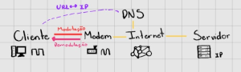
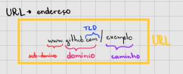

<h1 align="center">Curso de HTML5 e CSS3 | Curso em Vídeo</h1>

## Visão Geral

Este diretório contém os resumos, exercícios e desafios de um curso de HTML5 e CSS3, dividido em vários módulos que abordam desde os conceitos básicos até tópicos avançados. 

 

## Conteúdos
- [Visão Geral](#visão-geral)
- [Conteúdos](#conteúdos)
- [Ferramentas](#ferramentas)
- [Introdução](#introdução)
- [Módulos](#módulos)
- [Certificado](#certificado)
- [Referências](#referências)
 
 

## Ferramentas

 

## Introdução
Antes de entrarmos de fato no estudo de HTML5 e CSS3 precisamos ver alguns conceitos.

### 🔹 Internet
A internet é um conjunto de redes. Surgiu durante a Guerra Fria, a DARPA (Defense Advanced Research Projects Agency) com o objetivo de proteger centros militares trabalhou no desenvolvimento de uma rede de comunicação e em 1969 lançou a ARPANET (Advanced Research Projects Agency). 

Esta rede é percusora da internet que conhecemos hoje e foi a primeira a implementar a tecnologia de comutação de pacotes, que permitia a transmissão de dados em pequenos pacotes independentes que poderiam seguir caminhos diferentes até o destino. 

### 🔹 Cliente
Um cliente é um dispositivo, como um computador pessoal, smartphone, tablet, ou qualquer outro dispositivo que se conecta à internet para acessar recursos, serviços ou informações disponibilizadas por servidores.

### 🔹 Servidor
Um servidor é um computador ou sistema de computadores poderoso que armazena, processa e disponibiliza recursos, serviços ou informações para clientes através de uma rede, como a internet. Servidores podem hospedar websites, armazenar arquivos, gerenciar e-mails, entre outras funções.

### 🔹 Modem
Modem é um dispositivo que converte sinais digitais do cliente em sinais analógicos para transmissão pela infraestrutura de rede (como cabos de cobre ou fibras ópticas) e vice-versa. Ele é essencial para conectar o cliente à rede do provedor de internet (ISP).

**Modulação** - é o processo de converter um sinal digital em um sinal analógico.

**De-modulação** - é o processo inverso à modulação, onde um sinal analógico recebido é convertido de volta em um sinal digital compreensível pelo dispositivo cliente.

### 🔹 Domínio VS Hospedagem
**Domínio** refere-se ao endereço único de um site na internet (por exemplo, www.instagram.com), enquanto **hospedagem** se refere ao serviço de armazenamento e disponibilização dos arquivos, dados e recursos desse site em servidores que estão online e acessíveis pela internet.

### 🔹 DNS
DNS é um sistema hierárquico distribuído responsável por traduzir nomes de domínio em endereços IP numéricos utilizados pelas máquinas na internet. Ele permite que os clientes acessem recursos na internet usando nomes de domínio fáceis de lembrar, em vez de terem que lembrar os endereços IP específicos de cada recurso.

   
   

### 🔹 HTML5
HTML5 é a quinta versão da linguagem de marcação HyperText Markup Language (HTML), utilizada para estruturar e apresentar conteúdo na web. Utiliza tags (<> e </>) e elementos semânticos.

### 🔹 CSS3
CSS3, ou Cascading Style Sheets nível 3, é a versão mais recente da linguagem utilizada para estilizar documentos HTML e XML na web. Ele permite aos desenvolvedores aplicar estilos mais complexos e sofisticados às páginas web, incluindo gradientes, sombras, bordas arredondadas, transições suaves e animações. 

 

## Módulos

1. [**Fundamentos de HTML5 e CSS3**](modulo01/README.md)
   - Conceitos Básicos
   - Preparação do Ambiente
   - Semântica do HTML5
   - Textos e Títulos
   - Ligações
   - Multimídia
   - Estilos

2. **Ainda estudando...**

 

## Certificado

Entre aqui para conferir o [certificado](https://www.linkedin.com/in/analuisarodriguesouza/details/certifications/) consquistado por mim ao final do curso.

 

## Referências

- Curso [HTML5 e CSS3 - Módulo 1](https://github.com/gustavoguanabara/html-css) do [Curso em Vídeo](https://www.cursoemvideo.com/)

